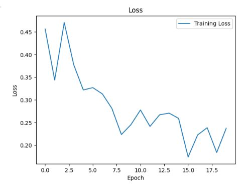
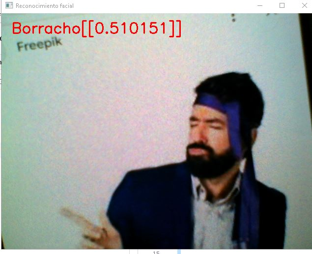
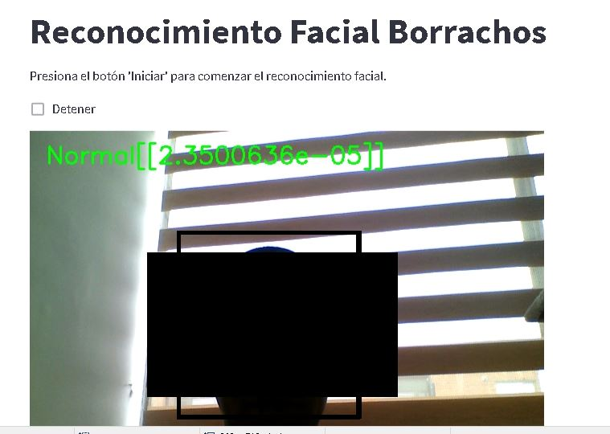

# Reconocimiento Facial con Streamlit

Este proyecto utiliza el reconocimiento facial para detectar si una persona está borracha o no, utilizando una red neuronal convolucional. La aplicación está desarrollada en Python utilizando las siguientes tecnologías: OpenCV, Keras y Streamlit.

## Pasos

## Paso1

Se creo el modelo en Colab, utlizando GPU para su entrenamiento, con imagenes de google de personas borrachas y no. con la estructura de directores de
-data
    --test
        --Borraho
        --No_borracho
    --train
        --Borraho
        --No_borracho

- Paquetes necesarios: `keras`,`TensorFlow`,`PIL`

### funcion de perdida del modelo, el cual es muy mejorale con mas imagenes de entrenamiento
[](tmp_readme/loss_model.JPG)

## Paso2
una vez creado el modelo se procesdio a guardarlo y ha realizar la ejecucion para su consumo, version desktop.

- Paquetes necesarios: `keras`,`TensorFlow`,`PIL`,`PIcv2L`
[](tmp_readme/prueba_desk_borra.JPG)

## Paso3 
Se crea una version web, con streamlit, buscando que esta sea publicada y usada.

- Paquetes necesarios: `keras`,`TensorFlow`,`PIL`,`PIcv2L`,`PstreamlitIcv2L`
[](tmp_readme/version_Web.JPG)

## Paso4
Se decide llevar esta azure, y desplegarla en un Service APP Web, para su consumo, este desploy se realiza desde GitHub

python -m streamlit run main.py --server.port 8000


## Instalación

1. Clonar el repositorio a tu máquina local:

   ```bash
   git clone https://github.com/ijlm/Reconocimiento-Imagenes-Python.git

    conda create --name reconocimiento-facial python=3.8
    conda activate reconocimiento-facial

    pip install -r requirements.txt

    streamlit run main.py
