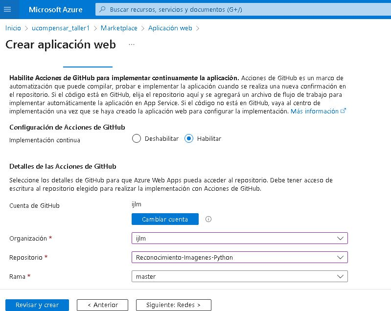
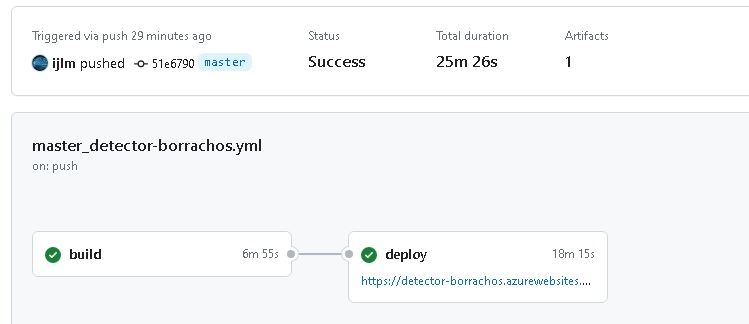

# Reconocimiento Facial de Borrachos en Keras

Este proyecto utiliza el reconocimiento facial para detectar si una persona está borracha o no utilizando una red neuronal convolucional. La aplicación está desarrollada en Python utilizando las siguientes tecnologías: OpenCV, Keras y Streamlit.

## Pasos

### Paso 1: Creación y entrenamiento del modelo

En esta etapa, se creó el modelo utilizando Colab, aprovechando la potencia de la GPU para su entrenamiento. Se utilizaron imágenes de personas borrachas y no borrachas obtenidas de fuentes externas. La estructura de directorios utilizada para el conjunto de datos fue la siguiente:

    --test
        --Borraho
        --No_borracho
    --train
        --Borraho
        --No_borracho

- Paquetes necesarios: `keras`,`TensorFlow`,`PIL`

Se utilizó la función de pérdida del modelo para evaluar su rendimiento. Sin embargo, se reconoce que el modelo puede mejorar con más imágenes de entrenamiento.


### Paso 2: Ejecución de la aplicación en versión desktop

Una vez creado el modelo, se procedió a guardarlo y realizar la ejecución de la aplicación en una versión de escritorio. Se utilizaron los paquetes necesarios: `keras`, `TensorFlow`, `PIL` y `OpenCV`.


### Paso 3: Creación de la versión web con Streamlit

Se creó una versión web de la aplicación utilizando Streamlit. El objetivo fue facilitar su acceso y uso. Se agregaron los paquetes necesarios: `keras`, `TensorFlow`, `PIL`, `OpenCV` y `Streamlit`.


### Paso 4: Despliegue en Azure

Se decidió llevar la aplicación a Azure y desplegarla en un Service App Web para su consumo. El despliegue se realiza directamente desde GitHub.

Comando para ejecutar la aplicación en Azure:

-cofiguramos la web app


-despliegue desde github


python -m streamlit run main.py --server.port 80


## Instalación

1. Clonar el repositorio a tu máquina local:

   ```bash
   git clone https://github.com/ijlm/Reconocimiento-Imagenes-Python.git

    conda create --name reconocimiento-facial python=3.8
    conda activate reconocimiento-facial

    pip install -r requirements.txt

    streamlit run main.py
